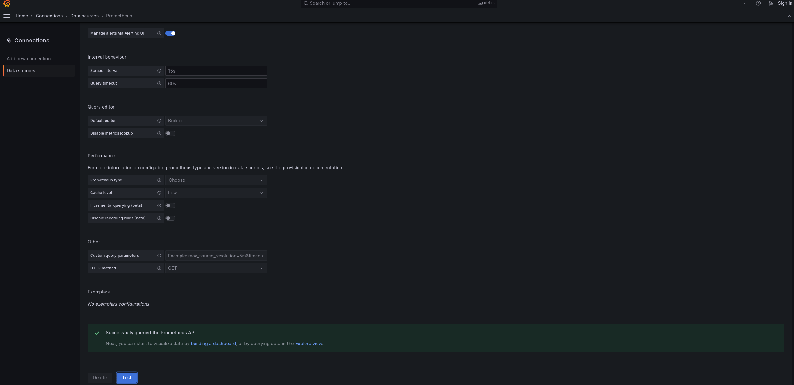
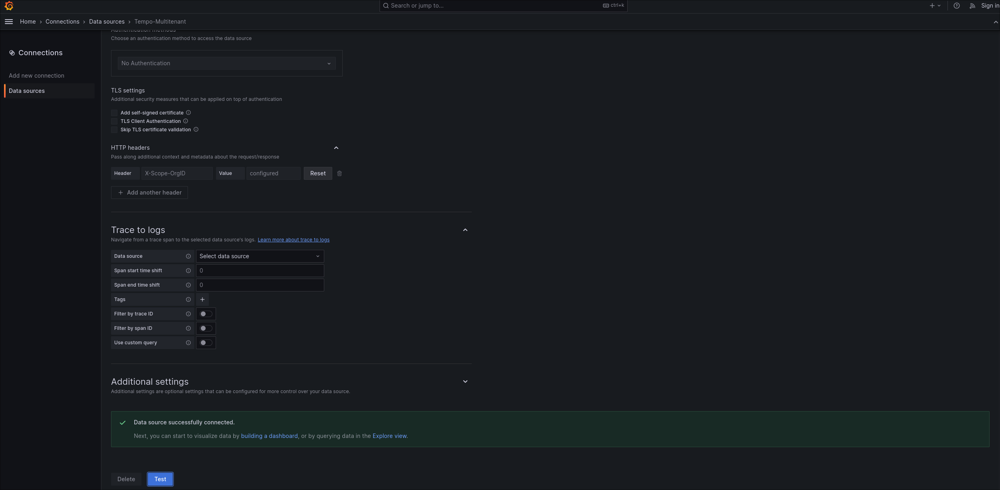
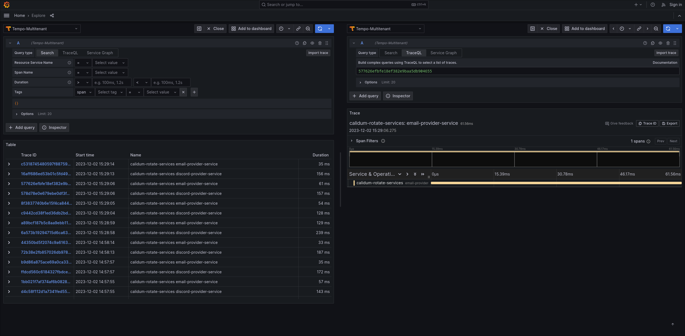

# Contributing to Calidum Rotae Backend

Want to contribute to Calidum Rotae Backend? Here's an in-depth guide on how to do that.

## Dependencies

* [Go](https://go.dev/doc/install)
* [docker](https://docs.docker.com/get-docker/)
* [docker-compose](https://docs.docker.com/compose/install/)

### protoc

You'll also want to install the latest version of [protoc](https://grpc.io/docs/protoc-installation/) to be able to generate Go files from your Protobuf spec.

### other dependencies

Simply run this command to install the other dependencies:
```bash
$ make
```

## Generating gRPC Go files

To generate the gRPC Go files from the Protobuf spec, run this command:
```bash
$ make grpc
```

## Local development

To run the project locally using `docker-compose`, simply run this command:
```bash
$ make docker-compose-dev
```

The command ```make docker-compose-dev``` will launch an instance of:

- calidum_rotae_service
- discord_provider
- email_provider
- grafana
- prometheus
- tempo
- opentelemetry-collector

Once you have executed the commands mentioned above, you can now test the API and view the traces generated by OTEL.

1. Visit the Grafana instance at http://localhost:8080.

2. Check if the data sources are correctly connected.



3. To test the API, execute this command:
```bash
curl -X POST \
  http://localhost:3000/ \
  -H 'X-API-KEY: your_calidum_rotae_service_api_key_here' \
  -H 'Content-Type: application/json' \
  -d '{
  "Sender": {
    "FirstName": "firtname",
    "LastName": "lastname",
    "Email": "email@email.com"
  },
  "RequestService": "service",
  "RequestDetails": "details"
}'
```

4. Go to the "Explore" section in Grafana to see if the traces are present (wait 15 seconds before executing the query). The traces should be visible.


